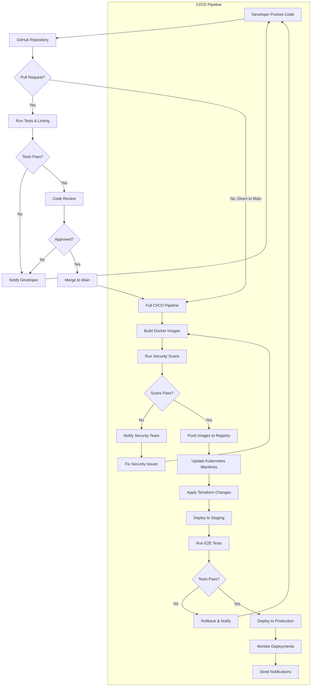

# CI/CD Pipeline Documentation

This document outlines the Continuous Integration and Continuous Deployment (CI/CD) pipeline for Spectra infrastructure.

## Pipeline Overview

## Pipeline Stages

### 1. Code Commit & PR Validation

- **Triggered by**: Code pushes or pull requests
- **Actions**:
  - Run linting and code style checks
  - Execute unit tests
  - Calculate test coverage
  - Static code analysis

### 2. Build & Security Scan

- **Triggered by**: Successful PR merge to main
- **Actions**:
  - Build Docker images
  - Scan images for vulnerabilities
  - Check for secrets in code
  - SAST (Static Application Security Testing)
  - SCA (Software Composition Analysis)

### 3. Infrastructure Verification

- **Triggered by**: Successful security scan
- **Actions**:
  - Run Terraform validation
  - Generate infrastructure change plan
  - Check for compliance violations
  - Cost estimation for changes

### 4. Staging Deployment

- **Triggered by**: Successful infrastructure verification
- **Actions**:
  - Deploy to staging environment
  - Run database migrations
  - Run integration tests
  - Performance testing
  - Accessibility testing

### 5. Production Deployment

- **Triggered by**: Successful staging deployment
- **Actions**:
  - Deploy to production environment
  - Run database migrations
  - Perform health checks
  - Implement gradual rollout (if enabled)
  - Enable monitoring alerts

### 6. Post-Deployment

- **Triggered by**: Successful production deployment
- **Actions**:
  - Run smoke tests
  - Monitor key metrics
  - Update documentation
  - Send deployment notifications

## Pipeline Configuration

### Environment Variables

Environment-specific variables are stored in GitHub Secrets:

- `AWS_ACCESS_KEY_ID`: AWS access key
- `AWS_SECRET_ACCESS_KEY`: AWS secret key
- `DOCKER_USERNAME`: Docker registry username
- `DOCKER_PASSWORD`: Docker registry password
- `RAILWAY_TOKEN`: Railway deployment token
- `TERRAFORM_API_TOKEN`: Terraform Cloud API token

### Deployment Approvals

- Staging deployments are automatic after tests pass
- Production deployments require manual approval in GitHub
- Rollbacks can be triggered automatically on error thresholds

## Security Considerations

- Secrets are never exposed in logs
- Infrastructure changes are reviewed before applying
- Container images are signed for chain of custody
- All deployments create audit trail entries

## Rollback Procedure

In case of deployment failures:

1. Automatic rollback triggers if health checks fail
2. Previous stable container images are redeployed
3. Database migrations have corresponding rollback scripts
4. Alert notification sent to operations team
5. Post-mortem analysis required for all failed deployments

## Testing Strategy

- **Unit Tests**: Run on every code push
- **Integration Tests**: Run in staging environment
- **End-to-End Tests**: Validate critical user journeys
- **Performance Tests**: Ensure performance SLAs are met
- **Security Tests**: Validate security requirements

## Reference Links

- [GitHub Actions Documentation](https://docs.github.com/en/actions)
- [Docker Security Best Practices](https://docs.docker.com/develop/security-best-practices/)
- [Terraform Workflow](https://www.terraform.io/docs/cloud/run/ui.html)
- [Kubernetes Deployment Strategies](https://kubernetes.io/docs/concepts/workloads/controllers/deployment/)
