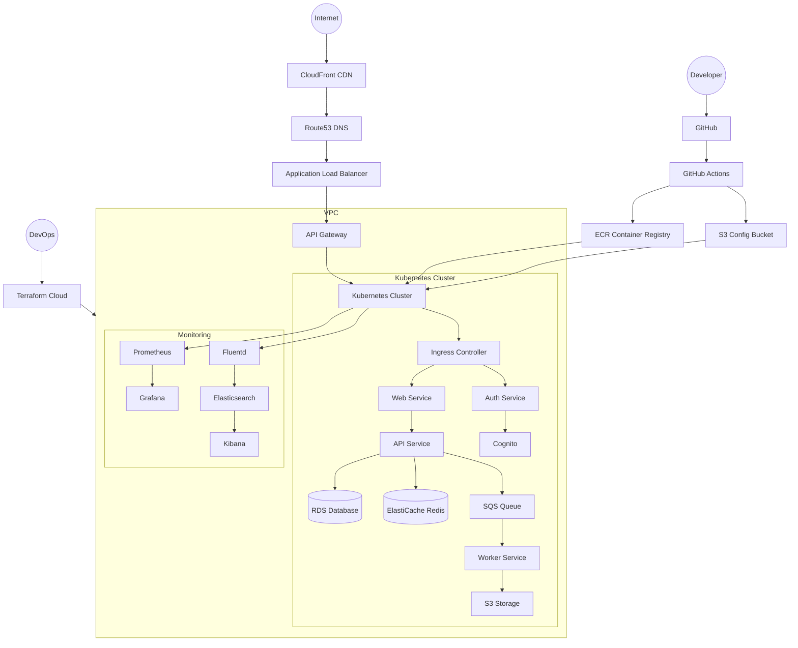

## Spectra Infrastructure Network Diagram

```mermaid
graph TD
    Internet((Internet)) --> CloudFront[CloudFront CDN]
    CloudFront --> Route53[Route53 DNS]
    Route53 --> ALB[Application Load Balancer]
    ALB --> APIGateway[API Gateway]
    
    subgraph "VPC"
        APIGateway --> K8S[Kubernetes Cluster]
        
        subgraph "Kubernetes Cluster"
            K8S --> IngressController[Ingress Controller]
            IngressController --> WebService[Web Service]
                        WebService --> APIService[API Service]
            IngressController --> AuthService[Auth Service]
            
            APIService --> RDS[(RDS Database)]
            APIService --> ElastiCache[(ElastiCache Redis)]
            AuthService --> Cognito[Cognito]
            
            APIService --> SQS[SQS Queue]
            SQS --> WorkerService[Worker Service]
            
            WorkerService --> S3[S3 Storage]
        end
        
        subgraph "Monitoring"
            K8S --> Prometheus[Prometheus]
            K8S --> Fluentd[Fluentd]
            Prometheus --> Grafana[Grafana]
            Fluentd --> Elasticsearch[Elasticsearch]
            Elasticsearch --> Kibana[Kibana]
        end
    end
    
    GitHub[GitHub] --> Actions[GitHub Actions]
    Actions --> ECR[ECR Container Registry]
    Actions --> S3Config[S3 Config Bucket]
    ECR --> K8S
    S3Config --> K8S
    
    Developer((Developer)) --> GitHub
    DevOps((DevOps)) --> Terraform[Terraform Cloud]
    Terraform --> VPC
```

This diagram illustrates the network flow and component relationships in the Spectra infrastructure.
