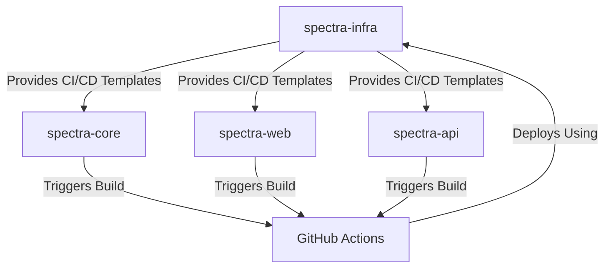
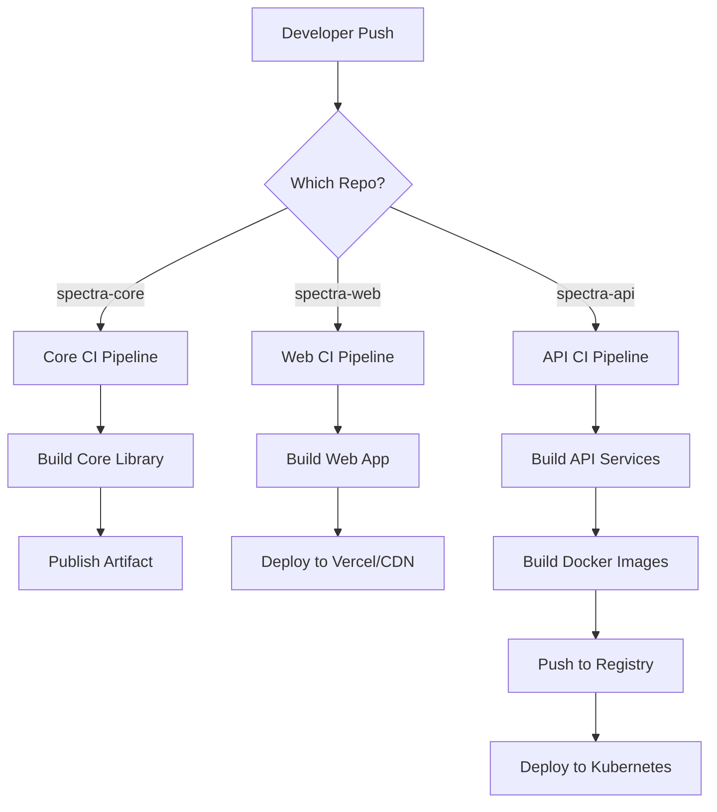

# Multi-Repository Integration Configuration

This document outlines how the different Spectra repositories integrate with the infrastructure repository.

## Repository Structure

The Spectra ecosystem consists of the following repositories:

1. **spectra-infra** (this repo): Infrastructure, deployment, and DevOps configurations
2. **spectra-core**: Core application code and shared libraries
3. **spectra-web**: Frontend web application code
4. **spectra-api**: Backend API services and business logic

## Integration Points

### CI/CD Integration

The infrastructure repository controls the CI/CD pipelines for all repositories through GitHub Actions:

### Deployment Flow

## Repository Cross-References

### spectra-core ➔ spectra-infra

- Uses deployment configurations from `spectra-infra/ci/templates`
- References Docker base images from `spectra-infra/docker/base`
- Publishes artifacts that are consumed by other repositories

### spectra-web ➔ spectra-infra

- Uses deployment configurations from `spectra-infra/ci/templates`
- Consumes environment configurations from `spectra-infra/environments`
- Relies on API endpoints defined in `spectra-infra/kubernetes/ingress.yaml`

### spectra-api ➔ spectra-infra

- Uses deployment configurations from `spectra-infra/ci/templates`
- Uses Docker configurations from `spectra-infra/docker`
- Deployed using Kubernetes manifests in `spectra-infra/kubernetes`
- Uses database migrations defined in `spectra-infra/migrations`
